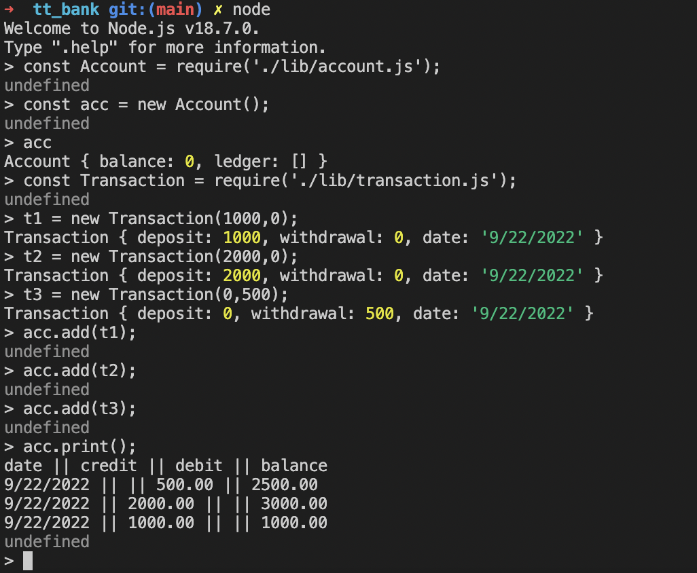

# Bank TT


## Installs and dependencies

npm
jest


## Approach

We have two classes, a transaction class and an account class. 

A transaction captures a deposit/withdrawal event. Each instance of the transaction class has an attribute for the date of its creation, the amount deposited, and the amount withdrawn.

Each instance of the account class stores an overall account balance as an instance variable, and has a ledger storing all the transactions that are added to it, which is an array (and instance variable). 

The intended usage is to create an account, then create transactions for each withdrawal/deposit. Each transaction should be addedto the account:
```
account.add(transaction);
```
Finally, a statement can be printed: 
```
account.print();
```

## Input handling

Each transaction is forced to declare an amount deposited and an amount withdrawn. These must be numbers >= 0. For a simple deposit, the amount withdrawn must be declared as 0, and vice versa. 

Deposits and withdrawals are rounded to 2 decimal places, digits being rounded to the nearest even digit. There is no more complicated input handling as it's not in the brief. 


## Usage




